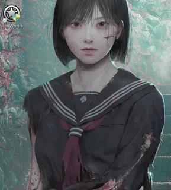

# Add to Steam
This tool allows you to easly add your non-steam games to Steam automaticly, just by righ-clicking on shortcut on .exe file and pressing "Add to Steam Library"

1) Run add_to_steam.exe
It will create a .reg file on the same folder (this file will create the context menu)
2) Run the created .reg file

And it's working! Pressing the option a second time will remove the shortcut.

If you have multiple Steam accounts you will need to select one from the list.
To discover your account ID visit https://steamid.io/

 
🟥 HOW TO MAKE THE STEAM OVERLAY WORK WITH NON-STEAM GAMES - Click to View Instructions 🟥

1. 🛑 Prerequisite: Disable Internal Steam Startup

If Steam tries to launch itself and the Scheduled Task tries to launch it, you will encounter conflicts. You must disable Steam's built-in auto-start feature first.

    Open the Steam desktop client.

    Go to Settings (Steam menu -> Settings).

    Navigate to the Interface tab.

    UNCHECK the option: "Run Steam when my computer starts".

    Click OK and fully close Steam.

2. 🛡️ Create the Windows Scheduled Task

This task will ensure Steam launches with "Highest Privileges" upon every login.

    Open the Task Scheduler (Search for Task Scheduler or run taskschd.msc).

    In the right-hand Actions pane, click Create Task....

Tab	Setting	Value
General	Name	Steam Admin Startup
General	Security Options	Check Run with highest privileges (Essential!)
General	Configure for	Your current Windows version (e.g., Windows 10/11)
Triggers	New...	Begin the task: At log on
Actions	New...	Action: Start a program
Actions	Program/script	"C:\Program Files (x86)\Steam\Steam.exe" (Use quotes!)
Settings		Check Allow task to be run on demand
Settings		Rule for task already running: Do not start a new instance

    Click OK to save the task. Windows will prompt you for your password to confirm the task's elevated rights.

Result: The next time you log into Windows, Steam will start automatically with Administrator privileges, solving the overlay issue for high-privilege games.

This program is open source. Do whatever you want with it. lol
